# CyrillOCR

This is an AI model made for recognising cyrillic handwriting.

## Hubert Nowakowski 160302
## Mukhammad Sattorov 159351

 

# Repository contents
 - `requirements-train.txt` dependencies needed for training and testing
 - `training_notebook.ipynb` notebook containing the entire training process alongside with the model definition
 - `testing_notebook.ipynb` running the test set, checking the test metrics, and analysing example images' prediction process
 - `src/helpers.py` various functions for loading, processing, and encoding/decoding data
 - `requirements.txt` dependencies needed for inference and streamlit deployment
 - `main.py` streamlit entrypoint, single-image inference
 - `logs` log files from the training process, can be viewed with tensorboard

# Dataset
Dataset has been taken from [this kaggle page](https://www.kaggle.com/datasets/constantinwerner/cyrillic-handwriting-dataset)

The model has been trained on ~70k images of cyrillic handwriting that contain a variety of pictures of notes and documents. The training images were resized to 200x800px, padded, and augmented with random stretches and squeezes, rotations, and contrast changes.

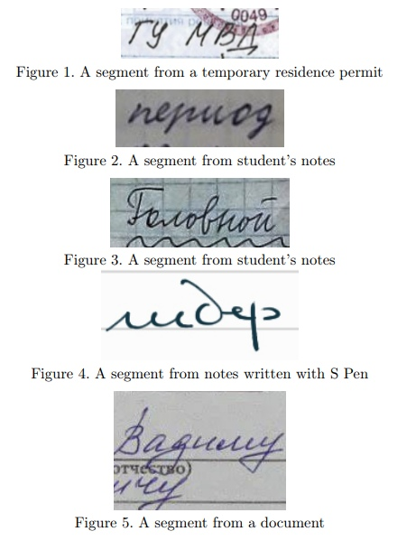

[Image source](https://www.kaggle.com/datasets/constantinwerner/cyrillic-handwriting-dataset)

# Deployment

The model is currently deployed on [streamlit](https://cyrillocr-g72qud3ad4xpotioxsxtr9.streamlit.app/)

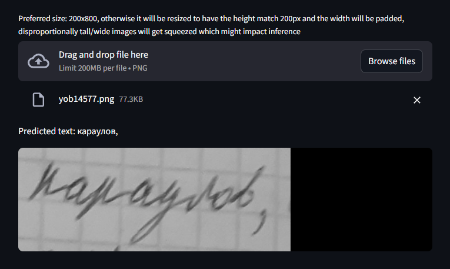

# Architecture

The model uses a somewhat standard OCR pipeline of:
- 3 convolutional layers with max pooling (1st layer with stride)
- 1 dense layer
- 2 LSTM's
- CTC for outputs

An important choice in the architecture was shrinking the "time dimension" of the tensor down to 50 before being fed into the dense layer and the other layers going forward. This was necessitated by the fact that the max length of text in the test samples was 40.

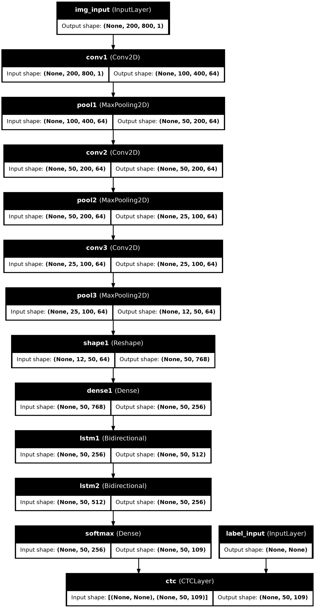

Note: the deployed model used for inference on a single image does not have the ctc layer and its output is decoded manually. (input format was easier to work with)

## CTC (Connectionist Temporal Classification) and CTC loss

As mentioned above, the 50 in the time dimension was a deliberate choice due to the test dataset's characteristics. This is due to the use of CTC - a way of predicting a variable-length text sequence from an image. 

In short, each time dimension pixel is assigned a probability distribution of the likelyhood of each character plus a blank character (NOT the spacebar). 

CTC loss (the loss function used for training the network) helps finetune the aforementioned probability distribution to favour the correct character.

Finally, when decoding the final label, the most likely character out of this distribution is chosen and the duplicate characters alongside with the blank characters are pruned; the below image showcases this process.

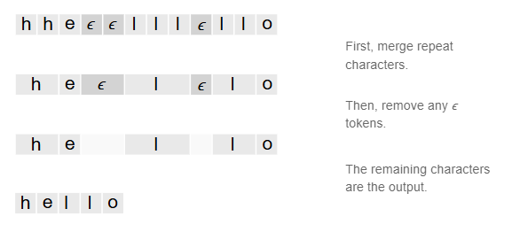

[Image source](https://distill.pub/2017/ctc/)

Any more than 50 and the model would waste computation time on a lot of blank spaces, and with lower values we could risk not having enough "character slots" for all of the text.

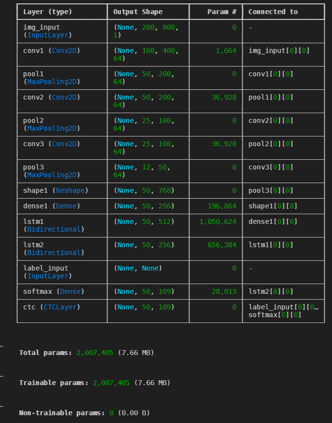

# Metrics and results
(Note: all metrics were being evaluated on the validation and training sets only)

We have used 5 metrics to gauge the model's performance and tracking the training process:

## Performance metrics

### Character error rate
A very standard metric for evaluating OCR models - it basically just compares the levenshtein distance between the prediction and the ground truth. (the lower the better)

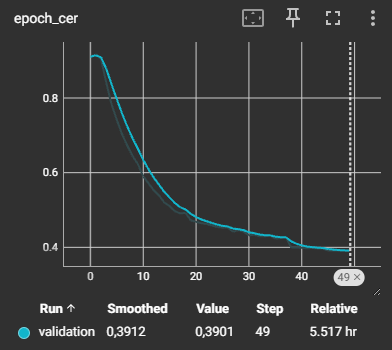

Validation: 0.39  
Test set: 0.57

A smooth downwards curve with no hiccups. We can notice a dip after epoch ~35 when the learning rate starts to decrease. Also unfortunately there is a bit of overfitting.

Note: this metric takes character case into account

### Exact word match
Fraction of exact matches between the prediction and the true label. (the higher the better)

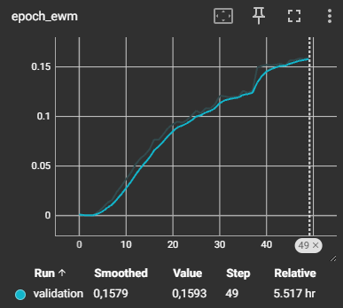

Validation: 0.16  
Test set: 0.04

Pattern very similar to CER, albeit the post-35-epoch finetuning is more pronounced. We can also notice it takes ~5 epochs for the model to figure out the first few labels exactly.

Note: this metric takes character case into account

## Training metrics

### Length ratio
The ratio between the average length of a prediction and the true label. Pairs well with the blank ratio. (closer to 1 is better)

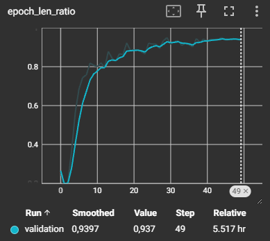

Validation: 0.94  
Test set: 0.9

Increases rapidly at first, then roughly after epoch 20 sees very little change, which represents that at this point the model has mostly figured out the lengths and is now finetuning the exact character predictions.

### Blank ratio
The ratio of predicted "character slots" being blank characters. This metric is a good representation of the model's confidence in predicting characters. A ratio close to 1 represents the model predicting very few actual characters, while a lower value means more meaningful predictions. (lower is *generally* better)

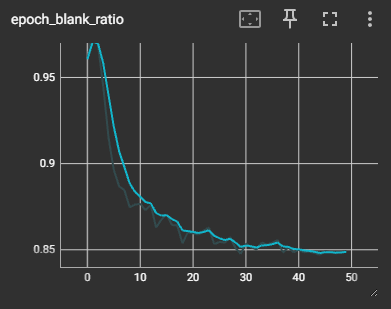

Validation: 0.85  
Test set: 0.82

Very similar pattern to the length ratio, except inverted. One noteable difference is that this metric stays more stable than the length ratio after the 20-ish epoch plateau. This could represent the model finetuning blank character placements to make the final predicted label more meaningful.

### Learning rate over time

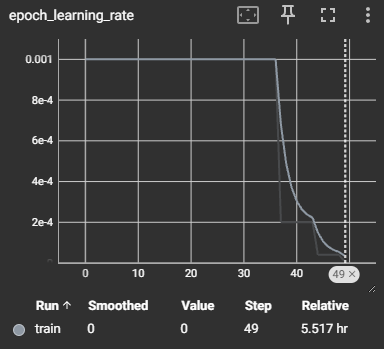

The model trains consistently up until roughly epoch 35, then quickly plateaus. Interestingly, this period between epoch 35 and 49 represents a noticeable increase in CER and EWM while other metrics plateau (could be finetuning into overfitting).

### Loss over time

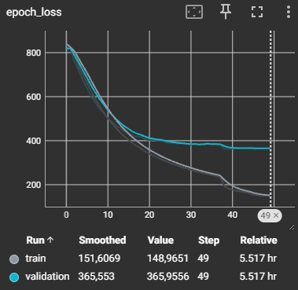

We can see that after a bit loss and validation loss diverge, especially after the 35 epoch plateau, normal loss gets finetuned much more than validation, could explain overfitting.

# Example analysis

We performed occlusion sensitivity analysis, which in short means how much of an impact on the prediction confidence was occluding a given vertical slice of the image.

Vertical axis represents change in confidence

Horizontal axis represents the image pixel

### богу

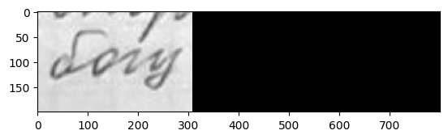
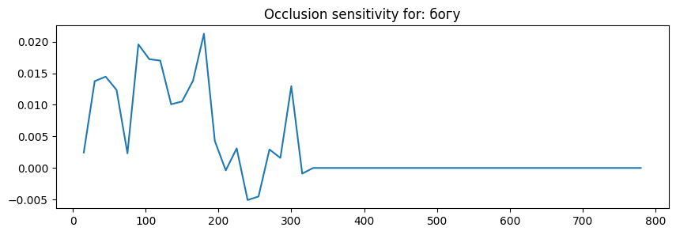

We can see the value spikes on the places the characters are located in with one interesting exception being the letter `у` where occluding it actually marginally *increases* the confidence whereas the empty space right before padding is very meaningful.

### Восточное

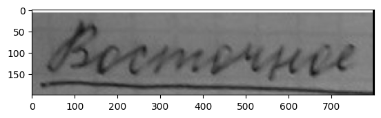
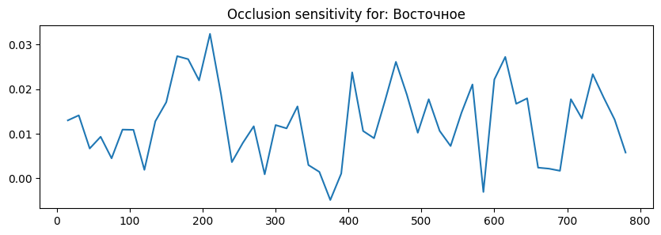

This example image is a bit more blurry. The spikes represent individual characters, although we can notice the dips on some character connections as well as an initial low probably due to the cursive on the `В` with it being just a diagonal line until pixel ~100.

### семитов

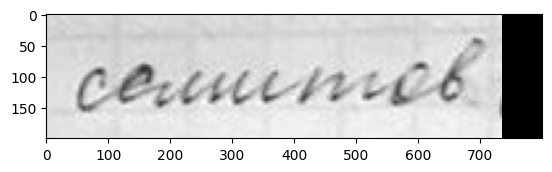
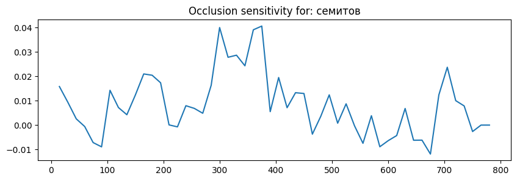

The model places a ton of importance on the `ми` part of the word, which makes sense as in the cyrillic alphabet (especially handwritten) a ton of characters look extremely similar.

### Project points:

- ocr problem 2
- own model 2 (the kaggle page had one example model but it's completely different)
- dataset over 10k photos 1
- overfitting examples 1
- data augmentation 1
- tensorboard 1
- streamlit deployment 1
- explanation of 3 predictions 2

Total: 11
